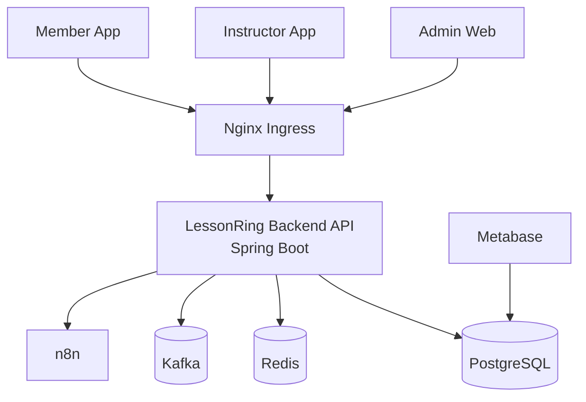
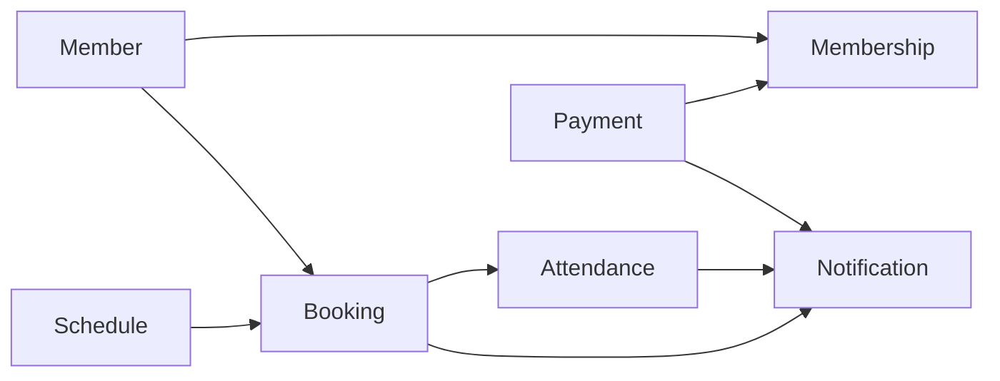
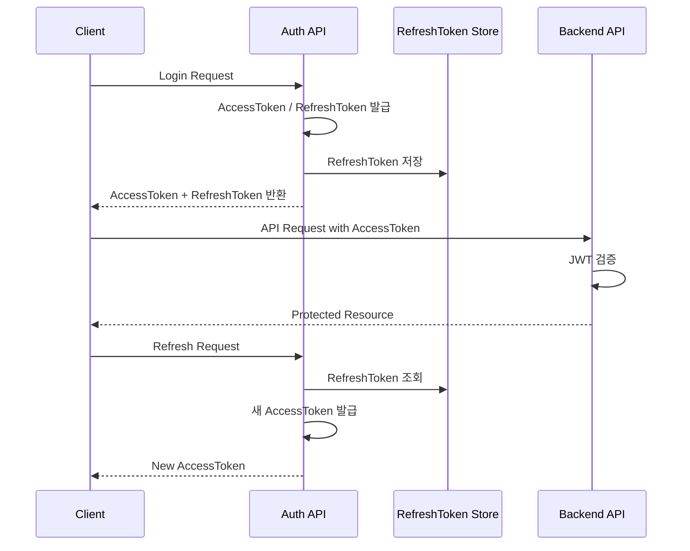
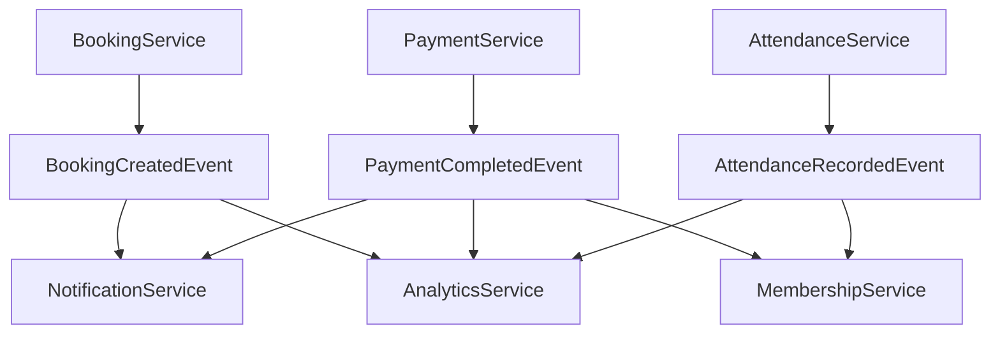

# System Architecture

LessonRing Backend의 전체 시스템 아키텍처를 정의한다.

이 문서는 Backend API, Database, Cache, Messaging, Automation, Analytics, Ingress 구조를 설명한다.

---

# 1. Overview

LessonRing은 레슨 스튜디오 운영을 위한 백엔드 시스템이다.

주요 시스템 구성 요소

```text
Backend API
PostgreSQL
Redis
Kafka
n8n
Metabase
Nginx Ingress
Kubernetes (k3s)
```

---

# 2. High Level Architecture



---

# 3. Infrastructure View

## 3.1 Client Layer

클라이언트는 아래 세 가지로 구분된다.

```text
Admin Web
Instructor App
Member App
```

설명

```text
Admin Web      → 관리자/운영자용 웹
Instructor App → 강사용 앱
Member App     → 회원용 앱
```

---

## 3.2 Ingress Layer

```text
Nginx Ingress
```

역할

```text
외부 요청 라우팅
도메인 분기
TLS/HTTPS 처리
Backend API 진입점
```

---

## 3.3 Application Layer

```text
LessonRing Backend API
```

기술 스택

```text
Java
Spring Boot
Spring Security
JPA
QueryDSL
Flyway
```

역할

```text
비즈니스 로직 처리
인증/인가 처리
REST API 제공
도메인 이벤트 발행
외부 시스템 연동
```

---

## 3.4 Data Layer

```text
PostgreSQL
```

역할

```text
핵심 데이터 저장
회원 / 이용권 / 예약 / 출석 / 결제 데이터 관리
Flyway 기반 스키마 버전 관리
```

---

## 3.5 Cache / Concurrency Layer

```text
Redis
```

역할

```text
분산 락
임시 캐시
토큰/세션 보조 저장 가능성
동시성 제어
```

대표 사용 예

```text
예약 동시성 제어
이용권 차감 경쟁 상태 제어
```

---

## 3.6 Messaging Layer

```text
Kafka
```

역할

```text
도메인 이벤트 비동기 처리
서비스 간 느슨한 결합
알림/통계/후속 처리 분리
```

대표 이벤트 예시

```text
BookingCreatedEvent
BookingCanceledEvent
PaymentCompletedEvent
AttendanceRecordedEvent
MembershipUsedEvent
```

---

## 3.7 Automation Layer

```text
n8n
Webhook
```

역할

```text
예약/결제/알림 후속 자동화
외부 서비스 연동
운영 자동화 워크플로우 구성
```

예시

```text
예약 생성 시 알림 자동화
결제 완료 시 후속 프로세스 실행
운영 통지 자동화
```

---

## 3.8 Analytics Layer

```text
Metabase
```

역할

```text
운영 지표 분석
매출 분석
예약/출석 통계
회원 분석
```

분석 기준 데이터

```text
PostgreSQL 운영 데이터
```

---

## 3.9 Platform Layer

```text
Docker
Kubernetes (k3s)
```

역할

```text
컨테이너 실행
서비스 배포
환경 분리
스케일링 기반 마련
```

---

# 4. Application Internal Architecture

LessonRing Backend 내부 구조는 다음과 같다.

```text
api
application
domain
infrastructure
common
```

설명

```text
api            → Controller / Request / Response
application    → Service / UseCase / Facade
domain         → Entity / Enum / Repository Interface / Domain Event
infrastructure → JPA / Query / Redis / Kafka / Feign / Webhook
common         → 공통 설정 / 응답 / 예외 / 보안 / 유틸
```

---

# 5. Module Structure

핵심 도메인 모듈

```text
auth
studio
instructor
member
membership
schedule
booking
attendance
payment
notification
analytics
integration
```

설명

```text
auth         → 인증 / JWT / RefreshToken / OAuth
studio       → 스튜디오 관리
instructor   → 강사 관리
member       → 회원 관리
membership   → 이용권 관리
schedule     → 수업 일정 관리
booking      → 예약 관리
attendance   → 출석 관리
payment      → 결제 관리
notification → 알림 관리
analytics    → 통계/집계
integration  → 외부 시스템 연동
```

---

# 6. Core Domain Flow

LessonRing의 핵심 비즈니스 흐름은 아래와 같다.



설명

```text
Member      → 회원
Membership  → 회원이 보유한 이용권
Schedule    → 실제 수업 일정
Booking     → 예약
Attendance  → 출석
Payment     → 결제
Notification→ 이벤트 기반 알림
```

---

# 7. Authentication Flow

현재 인증 구조는 JWT 기반이다.



---

# 8. Event Driven Flow

도메인 이벤트 흐름 예시



---

# 9. Data Ownership

핵심 데이터 저장소는 PostgreSQL이다.

주요 테이블

```text
studio
instructor
member
membership
schedule
booking
attendance
payment
notification
refresh_token
```

원칙

```text
핵심 비즈니스 데이터는 PostgreSQL에 저장
캐시/락/임시 데이터는 Redis 사용
비동기 이벤트 전달은 Kafka 사용
분석은 Metabase에서 PostgreSQL 기준 조회
```

---

# 10. Non-Functional Concerns

## 10.1 Security

```text
JWT 인증
RefreshToken 저장/재발급
Spring Security 기반 인가
향후 Kakao OAuth 연동
```

## 10.2 Concurrency

```text
Redis Distributed Lock 사용
예약/이용권 차감 동시성 보호
```

## 10.3 Scalability

```text
Docker 기반 실행
k3s 기반 배포
Ingress 기반 외부 노출
```

## 10.4 Observability

```text
Scouter
OpenLens
Metabase
```

---

# 11. Summary

```text
LessonRing Backend는 Modular Monolith 기반의 Spring Boot 애플리케이션이며,
PostgreSQL을 중심 데이터 저장소로 사용하고,
Redis / Kafka / n8n / Metabase를 주변 시스템으로 연결하는 구조를 가진다.

핵심 비즈니스 흐름은
Member → Membership → Schedule → Booking → Attendance → Payment → Notification
으로 이어지며,

인증은 JWT 기반,
비동기 후속 처리는 Event Driven Architecture 기반으로 확장 가능하도록 설계한다.
```